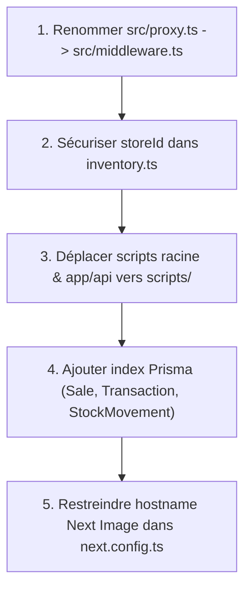

# 📑 Rapport de Diagnostic Technique Complet - Musages SaaS (Avril 2026)

---

## Executive Summary

Ce diagnostic complet évalue l'architecture, la sécurité, la qualité du code, la base de données et l'expérience utilisateur de la plateforme SaaS **Musages** (Next.js 16, React 19, Prisma, Supabase, NextAuth v5).

| Domaine | Statut | Criticité | Résumé des constats |
| :--- | :--- | :--- | :--- |
| 🛡️ **Middleware & Route Protection** | ❌ **CRITIQUE** | **HAUTE** | Le fichier middleware est nommé `src/proxy.ts` au lieu de `src/middleware.ts`, neutralisant la protection automatique des routes d'API/pages. |
| 🔐 **Sécurité Multi-Tenant** | ⚠️ **ATTENTION** | **HAUTE** | `createProduct` accepte un `data.storeId` fourni par le client sans vérifier s'il correspond au `session.user.storeId`. |
| ⚡ **Typage TypeScript** | ✅ **OPÉRATIONNEL** | **AUCUNE** | `tsc --noEmit` passe sans aucune erreur de compilation (0 erreur). |
| 🗄️ **Base de Données & Prisma** | 🟡 **OPTIMISATION** | **MOYENNE** | Pooler PgBouncer bien configuré. Manque d'index composés sur `Sale`, `Transaction` et `StockMovement`. |
| 💳 **Paiement PayTech** | ✅ **SOLIDE** | **AUCUNE** | Validation SHA256 des Webhooks IPN et transactions atomiques `$transaction` conformes. |
| 🎨 **UI/UX & Performance** | ✅ **STUNNING** | **FAIBLE** | Next.js 16 + React 19 + Tailwind + Framer Motion + Sentry + PWA. Wildcard `**.**` dans `next.config.ts` à restreindre. |

---

## 1. Analyse Architectural & Routing

### ❌ 1.1 Fichier Middleware non reconnu (`src/proxy.ts`)
* **Problème :** Next.js App Router exige que le middleware soit nommé exactement `middleware.ts` ou `src/middleware.ts`. Le fichier est actuellement nommé `src/proxy.ts`.
* **Impact :** Les requêtes entrantes ne traversent pas le middleware d'authentification et d'internationalisation. Les pages protégées ne redirigent pas automatiquement les utilisateurs non authentifiés vers `/login` au niveau Edge.
* **Recommandation :** Renommer `src/proxy.ts` en `src/middleware.ts` ou re-exporter le middleware depuis `src/middleware.ts`.

### ⚠️ 1.2 Import Dynamique Prisma dans l'Edge Runtime (`auth.config.ts`)
* **Problème :** Dans `src/auth.config.ts`, le callback `jwt` effectue un import dynamique de `@/lib/prisma` :
  ```typescript
  const { prisma } = await import("@/lib/prisma");
  ```
* **Impact :** Si ce callback est invoqué dans le Middleware (Edge Runtime), l'adaptateur Prisma `@prisma/adapter-pg` tentera de charger les modules Node `net` et `tls` non pris en compte dans Edge, générant un crash runtime Edge.
* **Recommandation :** Transférer l'enrichissement des tokens JWT dans les callbacks s'exécutant en environnement Node.js (`src/auth.ts`) ou utiliser l'API REST Supabase pour les requêtes Edge lightweight.

### 📁 1.3 Scripts de maintenance situés dans `src/app/api/`
* **Problème :** Les fichiers `src/app/api/promote-user.js` et `src/app/api/test-prisma.js` sont situés directement sous l'arborescence des routes Next.js.
* **Impact :** Risque de confusion pour le router Next.js et pollue l'arborescence des endpoints API.
* **Recommandation :** Déplacer ces deux fichiers dans le dossier `scripts/`.

---

## 2. Audit de Sécurité & Isolation Multi-Tenant

### 🚨 2.1 Contournement potentiel de périmètre d'établissement (`createProduct`)
* **Localisation :** [inventory.ts](file:///c:/Users/HP/Desktop/musages/src/lib/actions/inventory.ts#L23)
* **Constat :**
  ```typescript
  const storeId = data.storeId || session?.user?.storeId;
  ```
* **Vulnérabilité :** Si un utilisateur authentifié d'un magasin A envoie un payload avec `storeId` pointant vers le magasin B, le produit est créé dans le magasin B.
* **Correctif Recommandé :**
  ```typescript
  const storeId = session.user.role === "SUPER_ADMIN" && data.storeId 
    ? data.storeId 
    : session.user.storeId;
  ```

### ✅ 2.2 Intégration Webhook PayTech (IPN)
* **Localisation :** [route.ts](file:///c:/Users/HP/Desktop/musages/src/app/api/webhooks/paytech/route.ts)
* **Points Forts :**
  - Vérification cryptographique des hashs `api_key_sha256` et `api_secret_sha256`.
  - Idempotence vérifiée (si `payment.status === "SUCCESS"`, renvoie immédiatement).
  - Mise à jour atomique (`prisma.$transaction`) des tables `Payment`, `User` et `Store`.

---

## 3. Analyse Base de Données (Prisma & Supabase)

### 3.1 Architecture du Schéma Prisma
Le schéma couvre 17 modèles clés :
- **Logistique/Procurement :** `Supplier`, `Purchase`, `PurchaseItem`
- **Inventaire/POS :** `Product`, `Stock`, `StockMovement`, `Sale`, `SaleItem`
- **Finance/Trésorerie :** `Transaction`, `Payment`
- **RH/Audit :** `Employee`, `AuditLog`, `Notification`, `Feedback`
- **Multi-tenant/Auth :** `Store`, `User`, `Account`, `Session`, `VerificationToken`

### 3.2 Indexation et Performances de Requêtes
* **Index existants :** `Notification(userId, createdAt)`, `Product(storeId, sku)`, `Stock(storeId, productId)`, `Account(provider, providerAccountId)`.
* **Manque d'Index Composés :**
  - `Sale` : Pas d'index sur `(storeId, createdAt)` -> Requêtes de ventes quotidiennes lentes sur grosses tables.
  - `Transaction` : Pas d'index sur `(storeId, createdAt)` -> Calcul du solde de caisse sous-optimal.
  - `StockMovement` : Pas d'index sur `(storeId, productId, createdAt)`.
* **Recommandation :** Ajouter ces index dans `prisma/schema.prisma` pour pérennaliser la montée en charge.

---

## 4. Bilan Qualité Code & Outillage

### TypeScript (`tsc --noEmit`)
- **Statut :** **0 Erreur**.
- Tous les types d'action, props Next.js et extensions de sessions NextAuth (`src/types/next-auth.d.ts`) sont parfaitement déclarés.

### Nettoyage des Scripts Racine
- Plusieurs scripts temporaires existent à la racine : `clean_colors.js`, `fix_contrast.js`, `replace.js`, `standardize_orange.js`, `simulate-paytech.js`, `test-db.js`, `test-email.js`, `test-paytech-api.js`, `test-redis.js`.
- **Recommandation :** Consolider ces utilitaires sous le répertoire `scripts/` pour maintenir une racine de dépôt propre.

### Configuration Images (`next.config.ts`)
- Le pattern `{ protocol: 'https', hostname: '**.**' }` autorise le proxying d'images depuis n'importe quel domaine externe.
- **Recommandation :** Remplacer par une liste blanche explicite des domaines d'images autorisés (ex: Supabase storage, Unsplash, Gravatar/Google).

---

## 5. Plan d'Action Recommandé (Roadmap de Résolution)



### Priorité 1 (Immédiat - Sécurité & Routing)
1. **Renommer `src/proxy.ts` en `src/middleware.ts`** pour activer la protection des routes par NextAuth.
2. **Corriger l'isolation Multi-Tenant** dans `src/lib/actions/inventory.ts`.

### Priorité 2 (Nettoyage & Robustesse)
1. Déplacer `src/app/api/promote-user.js` et `src/app/api/test-prisma.js` dans `scripts/`.
2. Déplacer les 9 scripts `.js` de la racine vers `scripts/`.
3. Corriger l'import dynamique `@/lib/prisma` dans `src/auth.config.ts`.

### Priorité 3 (Optimisations & Scalabilité)
1. Ajouter les index composés dans `prisma/schema.prisma` et exécuter `npx prisma db push`.
2. Restreindre les `remotePatterns` dans `next.config.ts`.

---

## Conclusion

Le projet **Musages SaaS** présente une architecture très solide (Next.js 16 + React 19 + Prisma + Supabase + NextAuth v5). Les correctifs de typage apportés précédemment ont stabilisé la compilation. En appliquant la réorganisation du middleware et la sécurisation du `storeId`, la plateforme atteindra un niveau d'étanchéité et de préparation de classe production.
