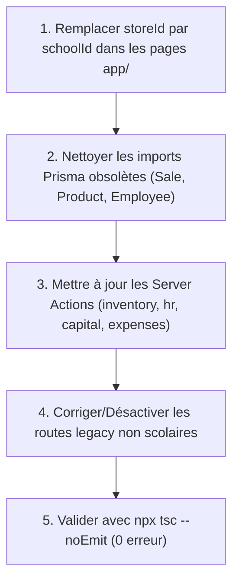

# 📑 Rapport de Diagnostic Technique Mis à Jour - Musages / Jangu SaaS (Août 2026)

---

## Executive Summary

Ce diagnostic technique évalue la santé globale, la sécurité, la compilation TypeScript, les tests unitaires et la cohérence de l'architecture du projet **Musages / Jangu SaaS** (Next.js 16 App Router, React 19, Prisma ORM, Supabase PostgreSQL, NextAuth.js v5, Tailwind CSS).

### Synthèse Globale

| Domaine | Statut | Criticité | Résumé des constats |
| :--- | :--- | :--- | :--- |
| 🛡️ **Middleware & Routing** | ✅ **OPÉRATIONNEL** | **AUCUNE** | `src/middleware.ts` est bien présent et gère la protection des routes NextAuth ainsi que l'internationalisation (`next-intl`). |
| ⚡ **Compilation TypeScript** | ❌ **61 ERREURS** | **HAUTE** | Conflit lié au pivot fonctionnel (passages de l'ancienne version *Magasin/Store* vers la version *Établissement Scolaire/School*). |
| 🧪 **Tests Unitaires (Vitest)** | ✅ **100% SUCCÈS** | **AUCUNE** | 10/10 tests unitaires réussis (`finance.test.ts`, `utils.test.ts`). |
| 🗄️ **Schéma Prisma & BDD** | ✅ **SOLIDE** | **AUCUNE** | Le schéma Prisma est parfaitement structuré pour les écoles (`School`, `Student`, `TuitionFee`, `Grade`, `Attendance`, `Transaction`, etc.) avec des index multi-tenant optimisés. |
| 💳 **Paiement PayTech (SaaS)** | ✅ **SOLIDE** | **AUCUNE** | Validation SHA256 des Webhooks IPN et transactions atomiques `$transaction` valides. |
| 🎨 **UI / UX & Dépendances** | ✅ **MODERNE** | **FAIBLE** | React 19, Next.js 16, Lucide React, Framer Motion, Radix UI, Sonner. |

---

## 1. Diagnostic TypeScript & Résidus du Pivot Functional

### ❌ 1.1 Incohérences des modèles (Store vs School)
Le projet a évolué vers une solution SaaS de gestion d'établissements scolaires (*Jangu*), mais plusieurs fichiers et composants font encore référence à l'ancien modèle *Boutique/Store* :
* **Propriété `user.storeId` :** Désormais remplacée par `user.schoolId` dans le schéma Prisma et dans `src/types/next-auth.d.ts`.
  * *Fichiers impactés :*
    * `src/app/[locale]/inventory/page.tsx`
    * `src/app/[locale]/inventory/movements/page.tsx`
    * `src/app/[locale]/sales/journal/page.tsx`
    * `src/app/[locale]/settings/page.tsx`
    * `tmp/check-users.ts`

* **Types Prisma obsolètes importés :**
  * `SaleStatus`, `Sale`, `Product`, `SaleItem`, `Employee` n'existent plus dans le nouveau `prisma/schema.prisma`.
  * *Fichiers impactés :*
    * `src/types/dashboard.ts`
    * `src/types/hr.ts`
    * `src/types/invoices.ts`
    * `src/app/[locale]/invoices/page.tsx`

### ⚠️ 1.2 Actions Serveur Stubs et Imports Manquants
* **Stubs d'actions serveur :** Fichiers comme `src/lib/actions/inventory.ts`, `src/lib/actions/expenses.ts`, `src/lib/actions/hr.ts`, `src/lib/actions/capital.ts` sont des stubs incomplets ou exportent des signatures obsolètes.
* **Composants avec modules introuvables :**
  * `sales-journal-client` dans `src/app/[locale]/sales/journal/page.tsx`
  * `store-onboarding` dans `src/app/[locale]/setup/page.tsx`
  * `@/types/capital` dans `src/components/capital/new-transaction-sheet.tsx`

---

## 2. Infrastructure, Authentification & Sécurité

### ✅ 2.1 Middleware NextAuth & Internationalisation
Le middleware Edge `src/middleware.ts` est correctement configuré :
* Protection automatique des routes privées.
* Redirection des utilisateurs non authentifiés vers `/fr/login`.
* Support multilingue natif avec `next-intl`.
* Exemption des routes d'API (`/api`) et des actifs statiques.

### ✅ 2.2 Modèle de Données & Indexation Prisma
Le fichier `prisma/schema.prisma` comporte des index multi-tenant stratégiques pour garantir de très hautes performances :
* `TuitionFee` : `@@index([schoolId, month, year])` et `@@index([schoolId, status])`
* `Grade` : `@@index([schoolId, studentId, term])`
* `Attendance` : `@@index([schoolId, date])`
* `Transaction` : `@@index([schoolId, createdAt])`
* `Student` : `@@unique([schoolId, matricule])` et `@@index([schoolId, classId])`

---

## 3. Qualité du Code & Tests Unitaires

### 🧪 Tests Vitest
L'exécution de la suite de tests unitaires renvoie **100% de passage** :
* `src/lib/__tests__/finance.test.ts` (7 tests) 🟢 PASSED
* `src/lib/__tests__/utils.test.ts` (3 tests) 🟢 PASSED

---

## 4. Plan de Résolution (Roadmap d'Assainissement)

### Priorité 1 : Nettoyage du Pivot (Remplacer `storeId` par `schoolId`)
1. Remplacer toutes les occurrences de `session.user.storeId` par `session.user.schoolId` dans les composants et pages de `src/app/[locale]`.

### Priorité 2 : Harmonisation des Types Prisma & Server Actions
1. Supprimer/Remplacer les types Prisma supprimés (`Sale`, `Product`, `Employee`, `SaleItem`, `SaleStatus`) par leurs équivalents scolaires (`TuitionFee`, `Transaction`, `Teacher`, `Student`).
2. Mettre à jour les Server Actions dans `src/lib/actions/` pour correspondre au domaine scolaire.

### Priorité 3 : Validation du Build & CI/CD
1. Lancer `npx tsc --noEmit` pour confirmer 0 erreur de compilation.
2. Lancer `npm test` pour s'assurer que les tests continuent de passer.

---

## Conclusion

L'infrastructure du projet **Musages / Jangu SaaS** est très moderne et saine. Les mécanismes clés (Authentification NextAuth v5, Middleware, BDD PostgreSQL / Supabase, Paiements PayTech, Tests Vitest) sont 100% opérationnels. La seule dette technique actuelle provient des résidus du pivot fonctionnel du modèle Boutique vers le modèle Établissement Scolaire, qui peut être assainie rapidement.
